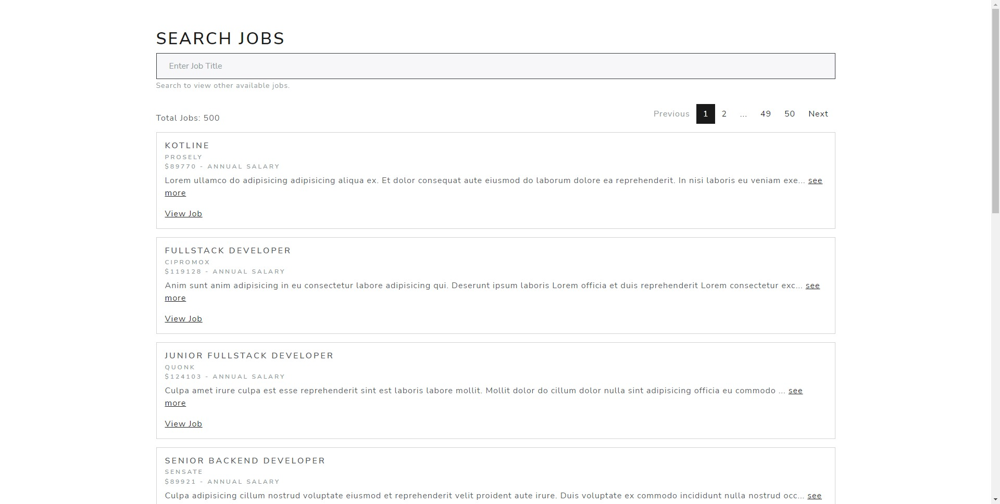
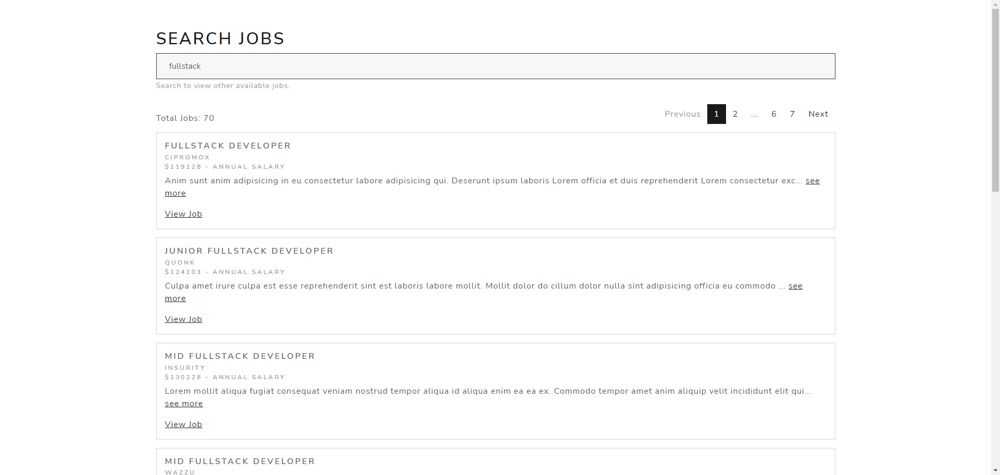
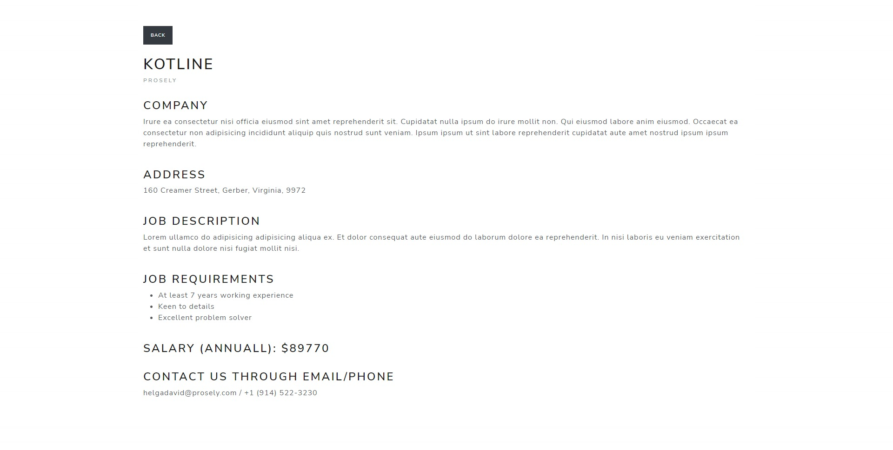

# EXAM
## Prepared by: Cyrus Rome Dela Cruz

### Programming Language:
1. NextJS - Typescript

### Development Features:
1. Caching with React Query
2. Custom hooks
3. Client Error Handling
4. Server Error Handling
5. Client Side Rendering
6. Server Side Rendering

### Installation steps:
1. clone repository
2. npm install
3. create .env.local file and copy and paste contents from .env.example
4. npm run dev -> to start dev environment

### Screenshots:
1. Index page that displays list of items (jobs)
   

2. Job search filtering
   

3. (Extra) Job details page
   